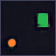
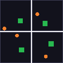
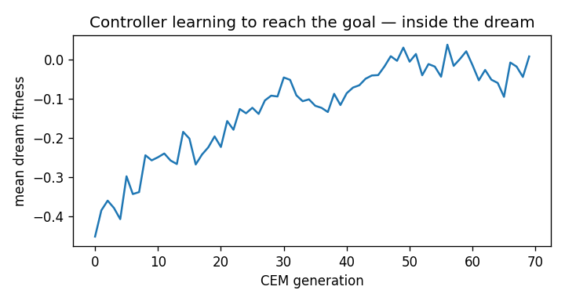
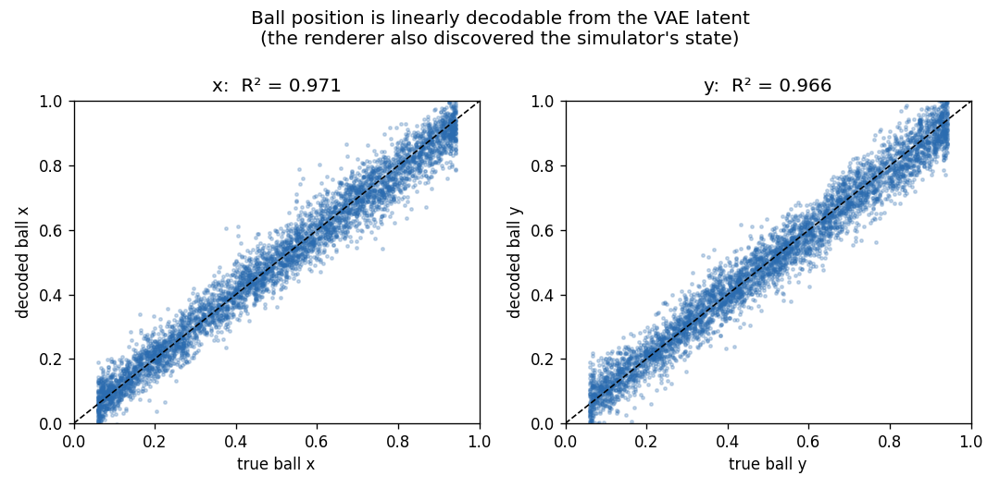

# A World Model, From Scratch

A small but complete **world model** — built from first principles in PyTorch and
trained on a laptop (Apple M4 Pro / MPS). It learns the dynamics of a 2D physics
world from raw pixels, can **hallucinate that world forward in its imagination**,
and trains a controller **entirely inside its own dream** that then succeeds in
the real environment.

This reproduces the central ideas of Ha & Schmidhuber's *World Models* (2018) —
the **V + M + C** decomposition — with everything written from scratch: the
environment, the variational autoencoder, the mixture-density RNN, the dream
engine, and a from-scratch CEM optimizer. No gym, no RL library, no pretrained
weights.

> A companion research briefing — a cited, fact-checked survey of the modern
> world-model landscape (Genie, Dreamer, Sora, JEPA, World Labs, Cosmos, …) — is
> in [`docs/RESEARCH.md`](docs/RESEARCH.md).

---

## The three results

**1. The world model dreams.** Given a single real frame and a sequence of
actions, the model hallucinates every following frame *in latent space only* and
decodes it for viewing. Columns: **real | VAE reconstruction | open-loop dream**.


**2. A pure hallucination.** Encode *one* real frame, then drive the dynamics
model with a scripted action pattern. The ball, the goal, the walls, the bounces
— all generated by the model, no simulator in the loop.



**3. A controller trained inside the dream.** The policy is evolved purely on
imagined rollouts (it never touches the real environment during training), then
deployed for real. Four episodes reaching four different goals:



*Validation fitness climbing as the controller learns to reach the goal — entirely in imagination:*



## Results (this run, Apple M4 Pro / MPS)

| Component | Metric | Value |
|---|---|---|
| **V** — VAE | foreground-weighted reconstruction loss | 35.5 |
| latent → position probe | test R² (x / y) | **0.97 / 0.97** (~3 px error) |
| **M** — MDN-RNN | next-latent NLL (32-D latent, 5 mixtures) | 14.2 |
| open-loop dream | mean pixel MSE over 80 steps | ~310 (drift accumulates — see below) |
| **C** — controller | **goal reached in the real env** | **39%** vs **5%** random |
| | mean closest distance to goal | **0.136** vs 0.358 random |

The controller was optimized **only on imagined rollouts** and never touched the
real environment during training, yet reaches the goal **~8× more often than
random** across 100 unseen start/goal pairs. End-to-end training is ~13 minutes on
a laptop GPU (48k frames collected, VAE 26 epochs, MDN-RNN 24 epochs, CEM 70
generations).

---

**The renderer discovered the simulator's state.** A probe decodes the ball's
position from the VAE latent with R² ≈ 0.97 — position was never given as a label:



---

## Where this sits in Fei-Fei Li's taxonomy

Fei-Fei Li's [*Functional Taxonomy of World Models*](https://www.worldlabs.ai/blog/taxonomy-of-world-models)
(June 2026) classifies world models by **what they output**:

| Category | Outputs | In this project |
|---|---|---|
| **Renderer** | observations (pixels) | the **VAE decoder** turns a latent back into a 64×64 frame |
| **Simulator** | state you can compute on | the **MDN-RNN** advances a faithful latent state from `(z, action)` |
| **Planner** | actions | the **controller** maps world-model state → action to reach a goal |

Li's thesis is that these are "three projections of a single underlying
understanding." This project is a miniature of exactly that: one learned
representation that is rendered, simulated, and planned over.

---

## Architecture

```
            ┌────────────┐   z_t      ┌──────────────┐   ĥ_t, ẑ_{t+1}
 frame ───► │  V: ConvVAE │ ─────────► │  M: MDN-RNN  │ ───────────────►  dream
   o_t      │  (encoder)  │            │   (LSTM +    │
            └────────────┘            │   mixture)   │
                  ▲                    └──────────────┘
                  │ decode                    │ [z_t, h_t]
                  ▼                            ▼
            reconstructed              ┌──────────────┐   a_t
              frame ô_t                │ C: controller│ ─────►  action
                                       │  (linear)    │
                                       └──────────────┘
```

- **V — Convolutional VAE** ([`wm/vae.py`](wm/vae.py)). 4 strided convs down to a
  32-D Gaussian latent, 4 transposed convs back up. Trained with a
  **foreground-weighted** reconstruction loss so the tiny moving ball isn't
  washed out by the background.
- **M — Mixture-Density RNN** ([`wm/mdnrnn.py`](wm/mdnrnn.py)). An LSTM that, from
  `[z_t, a_t]`, predicts a **mixture of Gaussians** over the next latent
  `z_{t+1}`. Modeling a distribution (not a point) is what lets us *sample*
  plausible futures — i.e. dream.
- **C — Controller** ([`wm/controller.py`](wm/controller.py)). A linear policy on
  `[z, h]`, optimized by a from-scratch **Cross-Entropy Method** that scores
  candidates purely on imagined rollouts. Reward inside the dream comes from a
  **latent→position probe** ([`wm/probe.py`](wm/probe.py)).

The **environment** ([`wm/env.py`](wm/env.py)) is a from-scratch NumPy physics
world: a thrusted ball with friction, a speed cap, and walls it bounces off, plus
a static goal. Deliberately simple and *learnable*, so dream quality is easy to
judge by eye.

---

## Run it

```bash
pip install -r requirements.txt
bash run_all.sh            # collect → VAE → probe → MDN-RNN → controller → evaluate
```

Or stage by stage (each writes to `artifacts/`):

```bash
export PYTHONPATH=$PWD
python3 -m wm.env             # sanity-check the environment (writes a GIF)
python3 -m wm.collect         # gather rollouts
python3 -m wm.train_vae       # train V, cache latents
python3 -m wm.probe           # latent→position probe
python3 -m wm.train_mdnrnn    # train M, render real-vs-dream comparison
python3 -m wm.controller      # evolve C inside the dream
python3 -m wm.evaluate        # deploy C in the real env vs random baseline
python3 -m wm.viz             # latent-space map + free-running dream
```

Everything runs on CPU, CUDA, or Apple MPS (auto-detected in
[`wm/config.py`](wm/config.py), which holds every hyperparameter).

---

## Repo layout

```
wm/
  config.py        all hyperparameters + device selection
  env.py           from-scratch 2D physics environment (no gym)
  vae.py           V: convolutional VAE + foreground-weighted loss
  mdnrnn.py        M: mixture-density RNN + NLL loss + sampler
  dream.py         the dream engine (open-loop latent rollouts) + comparison
  probe.py         latent→position probe (in-dream reward + interpretability)
  controller.py    C: CEM optimizer that trains the policy inside the dream
  evaluate.py      deploy the dream-trained controller in the real env
  viz.py           latent-space PCA + free-running hallucination
  collect.py / train_vae.py / train_mdnrnn.py   entry points
docs/
  RESEARCH.md      cited survey of the modern world-model landscape
artifacts/         GIFs, montages, plots, checkpoints' visualizations
```

## What's real, and what's simplified

This is a faithful, end-to-end reproduction of the *ideas* of Ha & Schmidhuber's
World Models on a small, learnable domain — not a frontier system. Honest caveats,
each of which mirrors a real open problem in the literature:

- **Open-loop dreams drift.** Over a long rollout, small per-step errors compound
  and the dream diverges from the true trajectory (the rising pixel MSE). This is
  the same **long-horizon drift** flagged for video and latent world models alike;
  the dynamics stay *qualitatively* correct (the ball still moves and bounces).
- **Model exploitation is real.** Training the controller too hard on a *fixed*
  set of *deterministic* dreams made it **worse** in reality (12% vs 39%) — it
  learned to exploit the model's flaws. Resampling scenarios + selecting by
  validation-in-imagination fixed it. This is a miniature of the robustness
  problems that dominate model-based RL.
- **Simple domain.** One ball + one goal in 2D is deliberately easy so dream
  quality is judgeable by eye. Pixel-rich, 3D, long-horizon worlds are exactly
  where Genie / Dreamer / World Labs operate (see [`docs/RESEARCH.md`](docs/RESEARCH.md)).
- **The controller is linear and its reward uses the probe.** Both are conscious
  simplifications that keep the entire system trainable from scratch on a laptop.

## References

- Ha & Schmidhuber, *World Models* (2018) — [arXiv:1803.10122](https://arxiv.org/abs/1803.10122)
- Hafner et al., *Dream to Control* / Dreamer; *Mastering Diverse Domains* (DreamerV3, *Nature* 2025)
- Fei-Fei Li & World Labs, *A Functional Taxonomy of World Models* (2026) — [worldlabs.ai](https://www.worldlabs.ai/blog/taxonomy-of-world-models)
- See [`docs/RESEARCH.md`](docs/RESEARCH.md) for the full, cited bibliography (60+ sources).
